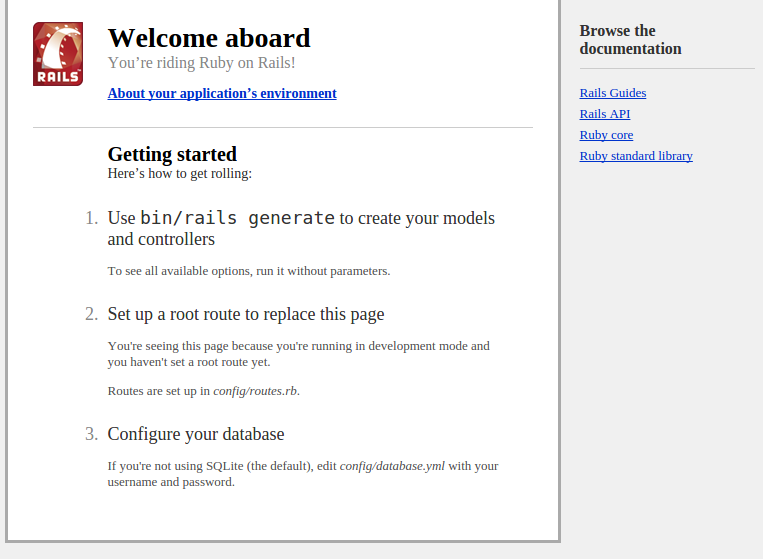

# Scaffolding your App

In this chapter we'll create our Rails app, or the basic scaffold of it at least. Specifically we'll cover:

- Creating your Rails App
- Running your Rails Server
- Cleaning up your Gemfile
- Running Bundle Install
- Getting to know your Rails application structure

## Run Rails new

Once you have installed the Rails Gem you now have access to Rails commands.

Let's use a simple but powerful one, `rails new`.

This command creates the basic Rails app boilerplate. In your terminal, run the following command:

```
$ rails new approach
```

This command will create a new Rails app and directory called `approach` and within that directory, all of the files and directories needed to power our Rails app.

Your command will also install some gems.

Move into your new application's directory.

```
$ cd approach
```

then run the following command:

```
rails s
```

> #### Using Codio?
> If you are using Codio, you'll need to add a flag to make the port bind to 0.0.0.0 rather than localhost. To do this run the following command instead: `rails s -b 0.0.0.0`

The s in this command stands for server. You can write server instead of s, but the shorthand is better and certainly minimizes typos.

One you have run this command you should see Rails and the default WEBrick server warm up. It should output something like in your terminal:

```
=> Booting WEBrick                                                                                                                                         
=> Rails 4.2.5 application starting in development on http://localhost:3000                                                                                  
=> Run `rails server -h` for more startup options                                                                                                          
=> Ctrl-C to shutdown server                                                                                                                               
[2015-11-16 22:27:34] INFO  WEBrick 1.3.1                                                                                                                  
[2015-11-16 22:27:34] INFO  ruby 2.1.5 (2014-11-13) [x86_64-linux]                                                                                         
[2015-11-16 22:27:34] INFO  WEBrick::HTTPServer#start: pid=451 port=3000  
```

This output shows the version of Rails you are running, where your Rails server will accept visitors (`http://localhost:3000`) and how to shut it down (`Ctrl+C`)

Next to some dates, it also provides info on your WEBrick version, version of Ruby and operating system as well as the port the application is running on (`3000`).

Visit the URL it points to, in my example `http://localhost:3000`. Yours may be a little different. If you are using Codio, please refer to the note above and use the additional command. If you are doing this, you can access the port by pressing the Box URL dropdown.

Once you visit this URL you should see the generic starting page for Rails.



Congratulations! Your first Rails app up and running.

If you return to your terminal after visiting the Rails splash page you should see something similar to the below:

```
Started GET "/" for 172.17.42.1 at 2015-11-16 22:27:45 +0000
Processing by Rails::WelcomeController#index as HTML
  Rendered /home/.rbenv/versions/2.1.5/lib/ruby/gems/2.1.0/gems/railties-4.2.5/lib/rails/templates/rails/welcome/index.html.erb (2.1ms)
Completed 200 OK in 28ms (Views: 11.1ms | ActiveRecord: 0.0ms)
```

What's happening here is by visiting the root route of `/` our Rails app looks for a defined route and a controller that handles that route. After that it looks for any assigned methods and view files (HTML etc.) to render.

Now, we've not set anything up. So Rails uses the out of the box `WelcomeController` controller file stored in the Rails Gem and the index method within the `WelcomeController` - indicated by `#index` - to render the welcome splash page view.

> If these terms of controller, view, method are a touch confusing it is worth going over the [Getting Started with Rails Guide](http://guides.rubyonrails.org/getting_started.html) to get used to those terms

We've not done anything special here but before we move onto the next chapter and start doing something interesting, let's sort our our `gemfile`.

## Set up the gemfile

The only thing we need to do now is remove the Coffeescript gem. Your cleaned up gemfile should look something like:

```
source 'https://rubygems.org'

gem 'rails', '4.2.5'
gem 'sqlite3'
gem 'sass-rails', '~> 5.0'
gem 'uglifier', '>= 1.3.0'
gem 'jquery-rails'
gem 'turbolinks'
gem 'jbuilder', '~> 2.0'
gem 'sdoc', '~> 0.4.0', group: :doc
gem 'puma'

# Use ActiveModel has_secure_password
# gem 'bcrypt', '~> 3.1.7'

group :development, :test do
  gem 'byebug'
end

group :development do
  gem 'web-console', '~> 2.0'
  gem 'spring'
end
```

if it isn't completely identical, that should be fine. Just ensure to remove the `coffeescript` gem.

We are removing the coffeescript gem because it generates ```.coffee``` files rather than ```.js``` files. 

> Coffeescript is a language that "compiles" into JavaScript. Basically, CoffeeScript is a shorthand version of JavaScript, which uses space in a file to remove the need for brackets and semi-colons.
> Personally, I don't feel a need for CoffeeScript and though many people are very productive with it, Rails and the many things you need to be productive with it are enough to deal with, never mind using something other than JavaScript

We also add the Puma gem. Puma is a little-configuration required, multi-threaded Rails server. It replaces the default Rails server but it is much faster. 

To add Puma you just add the line ```gem 'puma'```.

## Bundle Install

After removing the ```rails-coffeescript``` Gem and adding Puma we need to update our Rails gem bundle. To do this, run the bundle install command like so:

```
$ bundle install
```

This will install your gems, and if none are ready to install it will highlight that your bundle is complete. Every time you update your gemfile you need to run the bundle command.


## Getting to know your Rails app directory structure

When you start on your journey with Rails the large volume of directories and files created when you run ```rails new``` can be a rather intimidating thing. This is natural.

After a while, after creating a few projects, you'll get pretty comfortable with the set up. And, because most Rails applications have a near-identical structure, you'll actually come to cherish the basic structure.

We'll cover the application structure here, but you'll only get really comfortable after using Rails for a while. This is part of learning Rails, learning the _"Rails way"_.

When you create a Rails application it outputs the following directories and files:

|              | Description |
| ----         | ----------- |
| app/         | This is where the majority of your time will be spent. In this directory you create your models, controllers and views as well as any helpers and your custom CSS etc.        |
| bin/         | You'll rarely if ever peak into this directory. It is very important as it contains the code to run all of our rake and rails commands            |
| config/      | In this directory you define all of your application's basic wiring like where your database is, what email provider you are using. It also contains the vitally important `routes.rb` file.            |
| db/          | If you are using Sqlite this is where your binary DB file lives. This file also contains important migrations - your development history of the tables etc. you add to your database as well as any pre-seed information you want to add to your database            |
| lib/         | This directory holds any custom libraries of code for your app. Initially you won't add much here as a Rails developer but as your apps grow you will use this more to host your code to extend your Rails apps            |
| log/         | When your application runs it can write to this folder any errors and other important information.             |
| public/      | As the name suggests, this is where your publicly available stuff goes. So, things like your logo as well as your compiled and automatically joined up CSS etc.          |
| test/        | This is where you write your tests. In this book we'll not cover testing, but in your career you'll spend a lot of time here, or in a similar named directory, writing tests            |
| tmp/         | This is where temporary things like your cache live. Another directory you'll rarely if every look at            |
| vendor/      | When using Rails you'll often rely on other projects, libraries, Gems etc. to power your app. The Vendor file is where that will go            |
| config.ru    | This file is used by Rack-based servers to start your Rails application. You set your configuration in this rile           |
| Gemfile      | We've met this file before! This is where you define which Gems you want to use in your Rails app            |
| Gemfile.lock | A file which detailed all of your projects' gems            |
| rakefile     | This file lets you register any custom rake tasks - Rake is Ruby's version of Make. Google both to find out more            |
| README.rdoc  | Our project's readme. It is common to change this from a ``.rdoc`` file to a ```.md``` markdown file. A file in which to provide people who you are sharing your app with the instructions to get started            |

Here we have covered all of the top-level files and directories. Within these directories are a few more. For now, we'll leave them as the important ones will be covered in the following dedicated chapters.